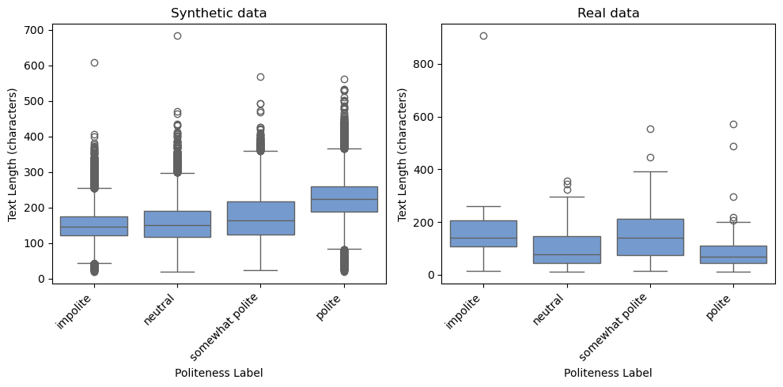
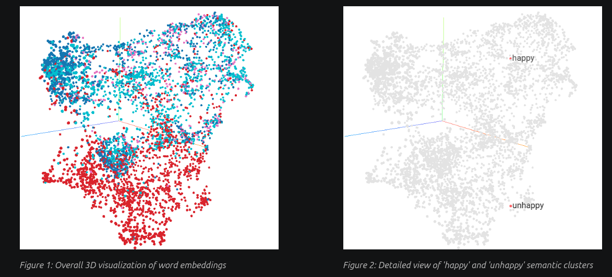
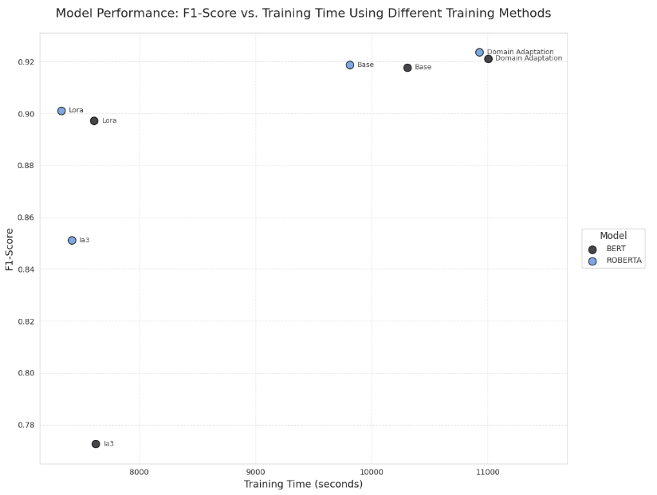
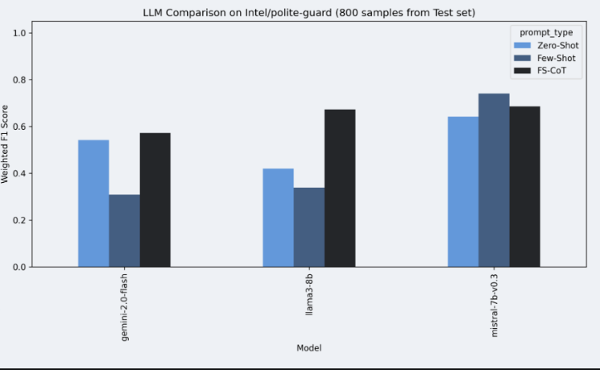
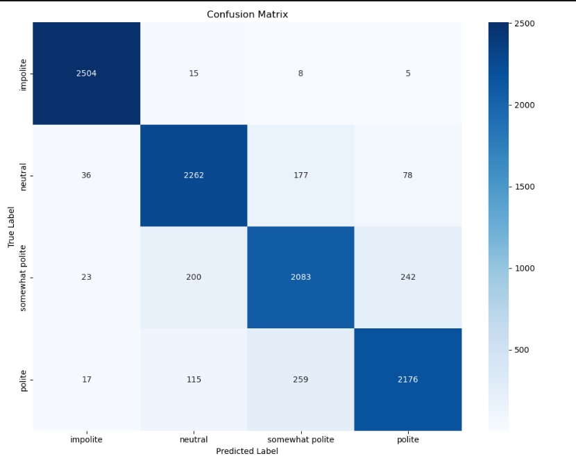

# Natural Language Processing: Polite Guard Text Classification

> **Project**
> <br />
> Course Unit: [Natural Language Processing](https://sigarra.up.pt/feup/pt/ucurr_geral.ficha_uc_view?pv_ocorrencia_id=542588), 2025/2026
> <br />
> Course: **Msc. in Artificial Intelligence**
> <br />
> Faculty: **FCUP / FEUP**
> <br />
> Project evaluation: **20**/20 

---

## Project Goals

The objective of this project was to develop, evaluate, and interpret NLP classifiers for the **Polite Guard dataset**, an open-source resource by Intel designed to categorize text politeness into four levels: *polite*, *somewhat polite*, *neutral*, and *impolite*. 

Throughout two assignments, we evolved our approach from traditional Machine Learning algorithms to state-of-the-art Deep Learning and Large Language Model (LLM) techniques:
- **Assignment 1:** Exploratory Data Analysis (EDA), text pre-processing, sparse/dense feature extraction (BoW, TF-IDF, Word2Vec), and traditional ML modeling (SVM, Logistic Regression, Naive Bayes).
- **Assignment 2:** Transformer fine-tuning (BERT, RoBERTa), Domain Adaptation via Masked Language Modeling (MLM), Parameter-Efficient Fine-Tuning (PEFT) using LoRA and IA3, and LLM Prompting (Zero-shot, Few-shot, Chain-of-Thought).

## Technical Approach

### 1. Data Exploration & Traditional ML (Phase 1)
We built a preprocessing pipeline and tested multiple feature extraction configurations across dozens of hyperparameter combinations.
* **Feature Representation:** Evaluated Bag-of-Words, TF-IDF, and dense Word2Vec embeddings. We visualized the embeddings in 3D using TensorBoard and UMAP, revealing clear semantic clustering (e.g., "happy" vs. "unhappy").
* **Baseline Models:** Support Vector Machines (SVM) paired with Word2Vec embeddings yielded the best traditional results, achieving an **88.48% F1-score**.





### 2. Transformer Fine-Tuning & Domain Adaptation (Phase 2)
To push past the traditional ML baseline, we fine-tuned encoder-only transformers (`bert-base-uncased` and `roberta-base`).
* **Domain Adaptation (MLM):** We adapted RoBERTa to the specific linguistic nuances of the synthetic Polite Guard corpus through intermediate Masked Language Modeling. 
* **Outcome:** RoBERTa + Domain Adaptation achieved a **92.40% F1-score**, successfully matching the dataset's official state-of-the-art benchmark.

### 3. Parameter-Efficient Fine-Tuning (PEFT)
To optimize computational resources, we explored LoRA and IA3 adapters.
* **LoRA:** Provided an exceptional trade-off, reducing training time by ~25% with only a marginal ~1.9% drop in F1-score compared to full fine-tuning.
* **IA3:** Yielded faster training but suffered a more significant performance degradation.



### 4. Large Language Model Prompting
We tested instruction-tuned LLMs (`Llama 3-8B`, `Mistral-7B-Instruct-v0.3`, `Gemini 2.0 Flash`) using various prompting strategies (Zero-Shot, Few-Shot, and Few-Shot Chain-of-Thought).
* **Insight:** LLMs struggled with the fuzzy, synthetic boundaries of the dataset, scoring between 60-70% F1. Fine-tuned models heavily outperformed generalized LLMs for this specific domain task.



## Classifier Evaluation & Comparison

| Model Architecture | Training Method | F1-Score | Key Insight |
| :--- | :--- | :--- | :--- |
| **RoBERTa** | **Domain Adaptation (MLM)** | **0.924** | **Matches SOTA.** Best performer overall; captured complex politeness nuances perfectly. |
| **RoBERTa** | Full Fine-Tuning | 0.918 | Strong deep learning baseline. |
| **RoBERTa** | LoRA (PEFT) | 0.901 | Highly efficient; 25% faster training with negligible performance loss. |
| **SVM** | Word2Vec Embeddings | 0.885 | Best traditional ML approach; fast inference but struggles with deep contextual mixed tones. |
| **Llama 3-8B** | Few-Shot Chain-of-Thought | ~0.700 | Best LLM prompt method, but significantly outclassed by task-specific fine-tuning. |



## Running the Code

**Setup Environment:**
```bash
# Create and activate a virtual environment
python -m venv nlp-env
source nlp-env/bin/activate

# Install dependencies
pip install -r requirements.txt
# (Includes transformers, peft, datasets, scikit-learn, gensim, wandb, etc.)
```

**Running Assignment 1 (Traditional ML):**
```bash
cd assign1
python script.py
```

**Running Assignment 2 (Transformers & LLMs):**
You can run the full pipelines or LLM classifiers via the provided scripts:
```bash
cd assign2/scripts
python transformers_classification.py  # For RoBERTa/BERT + Domain Adaptation
python llm_classifier.py               # For Gemini/Llama/Mistral prompting
```
*Note: Ensure your `WANDB_API_KEY` and `HUGGINGFACE_TOKEN` are configured in your environment for tracking and model downloading.*

## Tech Stack

**Languages & Core:** Python, Pandas, NumPy, Scikit-learn, NLTK, Gensim
**Deep Learning & NLP:** PyTorch, HuggingFace `transformers`, `datasets`, `peft` (LoRA, IA3)
**LLMs & Prompting:** Google Generative AI API, Mistral, Llama 3
**Tracking & Visualization:** Weights & Biases (WandB), TensorBoard, Matplotlib, Seaborn

---

## **Dataset Overview**

### **Source and Provenance**
The Polite Guard dataset is an open-source resource developed by Intel, fine-tuned from BERT, and made available on [GitHub](https://github.com/intel/polite-guard) and [Hugging Face](https://huggingface.co/Intel/polite-guard). It consists of:
- **50,000 synthetic samples** generated via Few-Shot prompting.
- **50,000 synthetic samples** generated via Chain-of-Thought (CoT) prompting.
- **200 annotated samples** from corporate training data (personal identifiers removed).

The synthetic data simulates customer service interactions across domains like finance, travel, food and drink, retail, sports clubs, culture and education, and professional development. It was generated using multiple large language models (Llama 3.1 8B-Instruct, Gemma 2 9B-It, Mixtral 8x7B-Instruct-v0.1) to ensure diversity, with prompts detailed in [this article](#).

### **Dataset Structure**
- **Training Set**: 80% of synthetic data (balanced across labels).
- **Validation Set**: 10% of synthetic data.
- **Test Set**: 10% of synthetic data.
- **Evaluation Set**: 200 real annotated samples (used solely for evaluation).

Each sample includes:
- **text**: The input text (string).
- **label**: One of *polite*, *somewhat polite*, *neutral*, or *impolite*.
- **source**: The model or system generating the text (e.g., LLM or LMS).
- **reasoning**: Explanation of why the text aligns with its label (for synthetic data).

### **Label Descriptions**
- **Polite**: Respectful, courteous, and friendly text.
- **Somewhat Polite**: Respectful but less warm or formal.
- **Neutral**: Factual and straightforward, lacking emotional tone.
- **Impolite**: Rude, blunt, or dismissive text.

---

## **References**
- Polite Guard GitHub: [https://github.com/intel/polite-guard](https://github.com/intel/polite-guard)
- Polite Guard Model: [https://huggingface.co/Intel/polite-guard](https://huggingface.co/Intel/polite-guard)

## Team (Group 17)

- **Adriano Machado** (up202105352)
- **Félix Martins** (up202108837)
- **Francisco da Ana** (up202108762)
